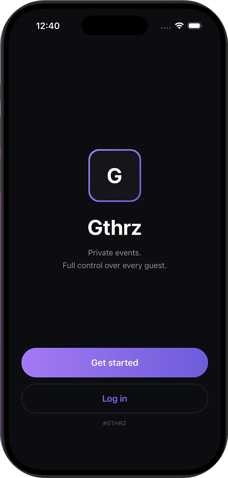
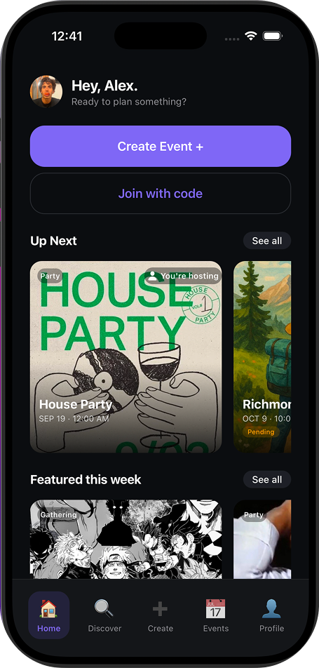
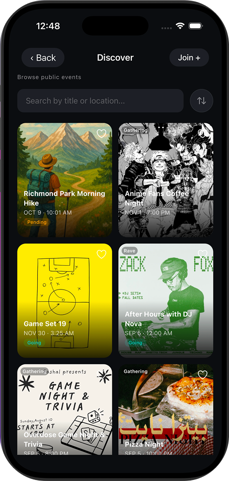
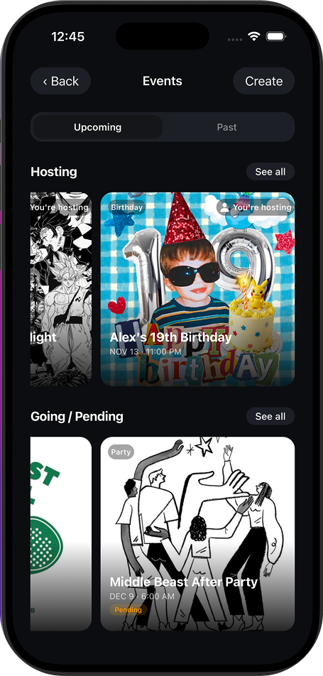
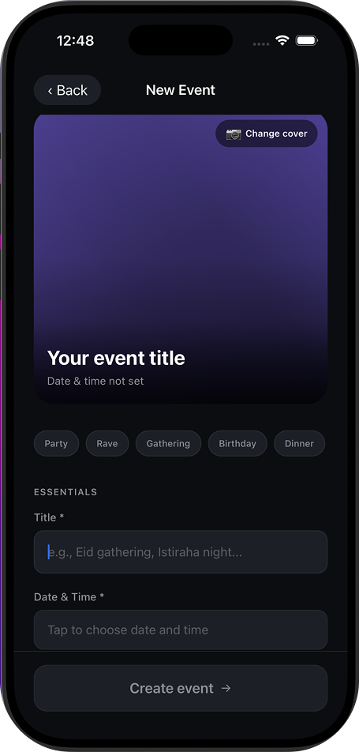
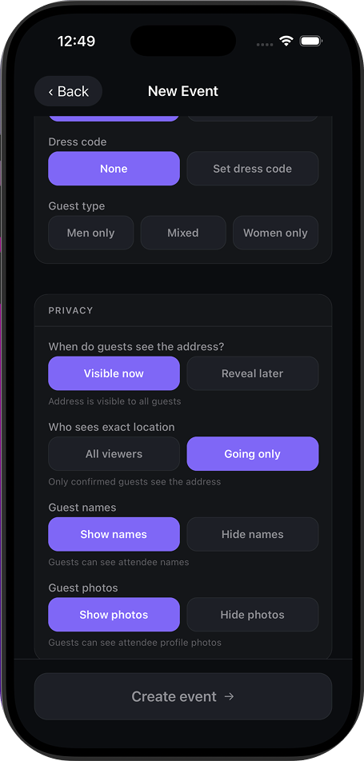
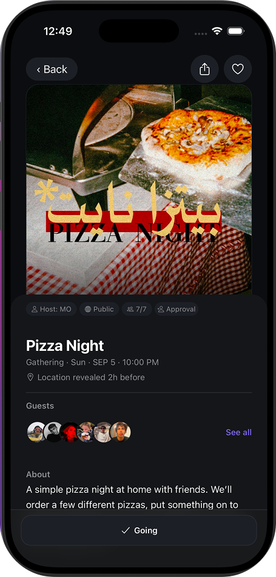
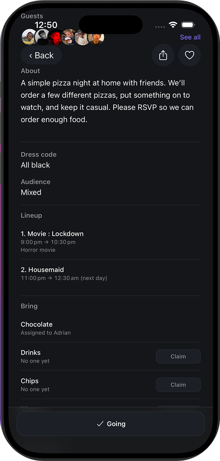
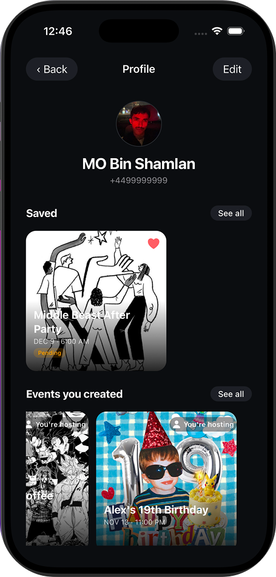

# Gthrz

Gthrz is a privacy-first mobile application for creating, joining, and managing private events.

Built as my undergraduate capstone project, Gthrz showcases secure mobile event management using **React Native**, **Expo**, and **Supabase**. The application combines event planning, RSVPs, guest management, realtime updates, and fine-grained privacy controls into a single mobile experience.

---

## Highlights

- 🔐 Phone OTP authentication with Supabase
- 👥 RSVP workflow with host approval
- 📍 Timed location reveal and privacy controls
- ⚡ Realtime updates using Supabase Realtime
- 📱 Built with React Native, Expo, and TypeScript

---

# Screenshots

## Welcome

<p align="center">
  
</p>

Secure phone OTP authentication powered by Supabase Authentication.

---

## Home • Discover • Events

<p align="center">
  
  
  
</p>

Personalized dashboard with upcoming events, public event discovery, and quick access to hosted and joined events.

---

## Event Creation

<p align="center">
  
  
</p>

Create customizable events with invite codes, audience restrictions, guest visibility settings, timed location reveal, and extensive privacy controls.

---

## Event Details

<p align="center">
  
  
</p>

View complete event information, manage RSVPs, browse guest lists, organize shared contributions, and access schedules from a single event page.

---

## Profile

<p align="center">
  
</p>

Manage your profile, saved events, and events you've created.

---

# Features

### Authentication

- Phone OTP authentication
- Invite code access

### Events

- Public and private event creation
- RSVP workflow
- Host approval
- Capacity limits
- Shared bring lists
- Event schedules

### Privacy

- Timed location reveal
- Guest name visibility
- Guest profile photo visibility

### Infrastructure

- Realtime updates using Supabase Realtime
- Push notification infrastructure
- Profile photos stored with Supabase Storage

> **Note**
>
> Event prices shown in the screenshots are informational only. Gthrz does not process payments.

---

# Technologies

- React Native
- Expo SDK 54
- Expo Router
- React Context API
- TypeScript
- Supabase Authentication
- PostgreSQL
- Row Level Security (RLS)
- Supabase Realtime
- Supabase Storage
- Expo Notifications
- Supabase Edge Functions

---

# Project Structure

```text
app/                    Screens and navigation
src/components/         Shared UI components
src/state/              Event, onboarding, and favourites state
src/lib/                Authentication, Supabase, realtime, notifications
src/theme/              Design system
supabase/functions/     Edge Functions
supabase/migrations/    Database migrations and RLS policies
```

---

# Database Schema

The repository includes a complete database schema snapshot located at:

```text
supabase/schema.sql
```

It documents:

- Tables
- Relationships
- Constraints
- Indexes
- Storage buckets
- Realtime configuration
- Row Level Security (RLS) policies

No production data, secrets, or user information are included.

---

# Running Locally

Create a `.env` file from `.env.example`.

```bash
EXPO_PUBLIC_SUPABASE_URL=
EXPO_PUBLIC_SUPABASE_ANON_KEY=
```

Install dependencies:

```bash
npm install
```

Start the development server:

```bash
npm run start
```

Or run Expo directly:

```bash
npx expo start --tunnel --go
```

Run the TypeScript type checker:

```bash
npx tsc --noEmit
```

---

# Authentication & Notifications

Production authentication uses Supabase Phone OTP with a configured SMS provider.

For development, a **Skip OTP (Demo Mode)** option is available. It creates a local identity without a Supabase session, making it useful for UI development while disabling authenticated features.

Push notification infrastructure has been implemented using Expo Notifications and a Supabase Edge Function.

End-to-end push delivery requires:

- Native development or production build
- Physical device
- Notification permission
- Configured EAS project
- Deployed Supabase Edge Function

---

# Current Limitations

- Push notifications have not yet been verified end-to-end on a physical device.
- Offline mode is not currently supported.
- Payment processing is not implemented.
- Favourites and recommendations are stored locally and do not sync across devices.
- Automated tests have not yet been added.
- Some Row Level Security policies will be further refined before a production deployment.

---

# License

This repository is source-available for portfolio and review purposes only.

You may view the source code, but you may not copy, modify, distribute, sublicense, or use it for commercial or production purposes without prior permission.

Copyright © 2026 Mohammed Ali Bin Shamlan.

All rights reserved.